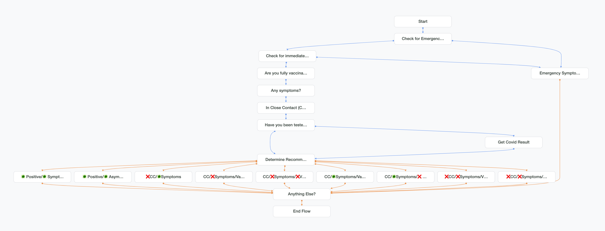
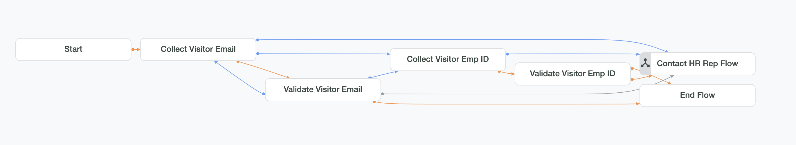

<p align="left"></p>

# COVID-19 Healthcare Virtual Agent using Google Dialogflow CX platform
A conversational chatbot to help companies to support their employees in:

a) Issuing a Digital Clearance pass that is required for entering the office building. Employees will complete a health screening and get the clearance pass for reporting to work in person.


b) Providing guidance to employees on how to isolate or quarantine and for how long - It will ask a series of questions to provide the correct guidance for the individual’s situation based on SF Health Department and .


c) Helping them find nearby COVID-19 vaccine centers based on various attributes; for example, if drop-ins are allowed, wheelchair accessibility, nearest centers from the individual’s address, etc. It will gather information from the customer and provide them vaccine center details include links to make an online appointment using the rich cards. It will use a webhook to fetch real-time data maintained by the SF Public Health Department.


d) Locating nearby Cornavirus Testing centers within 20 miles of the location provide by the visitor, etc. It will gather information from the customer and provide them testing location details include eligibility information for accessing testing at this location. The DialogFlow will use a webhook to fetch real-time data maintained by the SF Public Health department of testing locations.

## Approach
Dialogflow Fulfillment mechanism is using multiple webhooks built using node.js (deployed as GAE apps).
This module is a webhook example for Dialogflow. The webhook connects to a Cloud Firestore to validate the visitor by email (or employee id) and storing clearance passes.

* Default Flow Diagram
<p align="left"></p>

* Digital Clearance Pass Flow Diagram
<p align="left"></p>

* Self Assessment Flow Diagram
<p align="left"></p>

* Account Validation Flow Diagram
<p align="left"></p>

* Contact HR Representative Flow Diagram
<p align="left"></p>

* Digital Pass Granted Email Template
<p align="left"></p>

* Digital Pass Granted with Conditions Email Template
<p align="left"></p>


## Technical Stack
* Cloud Firestore
* Gmail for sending mails
* GAE apps
* Dialogflow CX

## Project Structure
```
.
└── covid19-healthcare-chatbot
    ├── exported_agent_COVID-19 Healthcare Virtual Agent.blob # Dialogflow CX Virtual Agent
    ├── webhook-dialogflow # Webhook codebase for deployment
        ├── covid19-clearancepass # Webhook required for validating vistor's email/empId in Firestore
            ├── app.js
            ├── package.json
            ├── app-config.yaml
        ├── covid19-vaccine-and-testing-locations # Webhook required for finding vaccine and testing locations in realtime
            ├── app.js
            ├── package.json
            ├── app-config.yaml
    ├── screenshots # Flow Diagrams and Email templates
        ├── Account_Validation_Flow-Diagram.png
        ├── Contact_HR_Representative_Flow-Diagram.png
        ├── Default_Flow-Diagram.png
        ├── Digital_Clearance_Pass_Flow-Diagram.png
        ├── Digital_Pass_Granted_w_Conditions-Email.png
        ├── Digital_Pass_Granted-Email.png
        ├── Self_Assessment_Flow-Diagram.png
    ├── README.md # Deployment instructions
```

## A. Setup Instructions

### 1. Project Setup
How to setup your project for this example can be found [here](https://cloud.google.com/dialogflow/cx/docs/quick/setup).

### 2. Dialogflow Agent Setup

1. Build an agent by following the instructions [here](https://cloud.google.com/dialogflow/cx/docs/quick/build-agent).
1. Import (restore) the agent using the following instructions [here](https://cloud.google.com/dialogflow/cx/docs/concept/agent#export).
1. Follow the instructions to restore the agent from "exported_agent_COVID-19 Healthcare Virtual Agent.blob".


### 3. Google App Engine Setup
This implementation is deployed on GCP using App Engine.
More info [here](https://cloud.google.com/appengine/docs/standard/nodejs/quickstart).

To run the node.js scripts on GCP, the `gcloud` command-line tool from the Google Cloud SDK is needed.
Refer to the [installation](https://cloud.google.com/sdk/install) page for the appropriate
instructions depending on your platform.

Note that this project has been tested on a Unix-based environment.

After installing, make sure to initialize your Cloud project:

`$ gcloud init`

### 4. Cloud Firestore Setup (Use Native mode database)
Quick start for Cloud Firestore can be found [here](https://cloud.google.com/firestore/docs/quickstart-servers#create_a_in_native_mode_database).

Make sure to setup rules for allowing writes on the new database

    rules_version = '2';
    service cloud.firestore {
        match /databases/{database}/documents {
            match /{document=**} {
                allow read, write: if request.auth != null;
            }
        }
    }

#### How to add data
This example connects to a Cloud Firestore with a collection with the following specification:

    Root collection
     user-data =>
         document_id
             uCQVcprA2PWMPOD4XJTi => {
                 'empId': 12345,
                 'email': 'alok.gupta@pridequest.com',
                 'firstname': 'Alok',
                 'lastname': 'Gupta'
             }

Examples how to add data to a collection can be found [here](https://cloud.google.com/firestore/docs/quickstart-servers#add_data).

    const Firestore = require('@google-cloud/firestore');
    const db = new Firestore({
        projectId: 'YOUR_PROJECT_ID',
        keyFilename: '/path/to/keyfile.json',
    });

    const docRef = db.collection('user-data').doc();

    await docRef.set({
        empId: 12345,
        email: 'alok.gupta@pridequest.com',
        firstname: 'Alok',
        lastname: 'Gupta'
    });

#### Sample data
Sample Users data [here](https://github.com/sadasystems/covid19-healthcare-chatbot/sample-users-data.csv)

### 5. Configure Gmail API for sending mails
1. Enable Gmail API [here](https://console.developers.google.com/start/api?id=gmail&credential=client_key)
2. Setup OAuth2.0 for for Server-Side Authorization [here](https://support.google.com/cloud/answer/6158849?hl=en#zippy=%2Cuser-consent)
3. You can generate the refresh and access token using Google OAuth Playground [here] (https://developers.google.com/oauthplayground/). If using this method, make sure the OAuth client ID has Authorized redirect URIs section entry for https://developers.google.com/oauthplayground.

You will need the clientID, secret, refresh token and access token in the next step.

### 6. **Install [Node 14.17.5 or greater](https://nodejs.org)**.

## B. Webhook App(s) Deployment

### 1. Clearance Pass App
#### Configure env variable values in app.yaml file
    $ cd ./covid19-healthcare-chatbot/webhook-dialogflow/covid19-clearancepass
    $ nano app.yaml
        MODE: prod
        ENABLE_MAIL: true
        MAIL_USERNAME: <put FROM Email address here>
        MAIL_OAUTH_CLIENTID: <put Client ID here>
        MAIL_OAUTH_CLIENT_SECRET: <put Client Secret here>
        MAIL_OAUTH_REFRESH_TOKEN: <put Refresh Token here>
        MAIL_OAUTH_ACCESS_TOKEN: <put Access Token here>

    * MODE property can also be set to 'trial' or 'test'.
    * 'trial' - Skips real-time account validations, clearance pass storage in the database, and email generation.
    * 'test' - Performs real-time account validations and store the clearance pass in the database. If emails are enabled, will send the email to the MAIL_USERNAME configured instead of the visitor's email address.
   
#### Deploy the app on GCP App Engine
    $ cd ./covid19-healthcare-chatbot/webhook-dialogflow/covid19-clearancepass
    
    $ npm install dependencies
	   - @google-cloud/trace-agent
	   - body-parser
	   - express
	   - firebase-admin
	   - firebase-functions
	   - mathjs
	   - moment
	   - nodemailer
	   - qrcode
	   - eslint
    
    $ gcloud app deploy app-config.yaml
* Copy the target url

### 2. COVID-19 Vaccine Access Points and Testing Centers App

#### Signup for access to SFData data sets
a. Signup to access San Francisco Datasets [here](https://data.sfgov.org/signup)

b. Create API key (personal authentication credentials) for calling API calls using HTTP Basic Authentication [here](https://data.sfgov.org/profile/edit/developer_settings)

c. Encode clientId:secret in Base64 format [here](https://toolbox.googleapps.com/apps/encode_decode/)

#### Configure env variable values in app.yaml file
    $ cd ./covid19-healthcare-chatbot/covid19-vaccine-and-testing-locations
    $ nano app.yaml
    
        COVID19_TESTING_CENTER_API: https://data.sfgov.org/resource/dtit-7gp4.json
        COVID19_TESTING_CENTER_API_BEARER_TOKEN: 'Basic <put Base64 encoded clientid:secret here>'
        COVID19_TESTING_CENTER_RADIUS_METERS: 32187
        COVID19_TESTING_CENTER_RADIUS_MILES: 20

        COVID19_VACCINE_ACCESS_POINTS_API: https://data.sfgov.org/resource/bw5r-gd57.json
        COVID19_VACCINE_ACCESS_POINTS_API_BEARER_TOKEN: 'Basic <put Base64 encoded clientid:secret here>'
        COVID19_VACCINE_ACCESS_POINTS_RADIUS_METERS: 32187
        COVID19_VACCINE_ACCESS_POINTS_RADIUS_MILES: 20
        MAX_NUMBER_OF_LOCATIONS_TO_FETCH: 3
	   
#### Deploy the app on GCP App Engine
    $ npm install dependencies
	   - @google-cloud/trace-agent
	   - axios
	   - body-parser
	   - express
	   - node-geocoder
	   - eslint
	   
    $ gcloud app deploy app-config.yaml
* Copy the target url

### 3. Configure Target URLs in your Virtual Agent
a. Go to your agent in CX console and click on Manage > Webhooks.

b. Edit the webhooks' values and change the URL into the field labeled Webhook URL.

    1. COVID-19-Healthcare-Webhook-ClearancePass
        `https://<paste here Clearance Pass App URL>/clearance-pass`

    1. COVID-19-Healthcare-Webhook-Locations
        `https://<paste here COVID-19 Vaccine Access Points and Testing Centers App URL>/covid19-locations`

c. Click Save.
   
   
## C. Configure Dialogflow Messenger 
You can integrate the text-based DF Messenger by following these steps [here](https://cloud.google.com/dialogflow/cx/docs/concept/integration/dialogflow-messenger)


## D. Usage
### Dialogflow Agent Example(s)

#### 1. COVID-19 Get a Clearance Pass
    [User] Hello,
    ↳ [Agent] Hi there! 👋 I'm the COVID-19 Healthcare virtual agent.
    [User] I need a clearance pass
    ↳ [Agent] Please provide your company's email address.
    [User] alok.gupta@pridequest.com
    ↳ [Agent] Have you experienced any of the following symptoms of COVID-19 in the past 10 days?
        {...}
    [User] ...

#### 2. COVID-19 Self Assessment
    [User] Hello,
    ↳ [Agent] Hi there! 👋 I'm the COVID-19 Healthcare virtual agent.
    [User] How long to stay home?
    ↳ [Agent] Welcome to our COVID-19 self-assessment tool. Say "Start COVID-19 Self Assessment"
    [User] Start COVID-19 Self Assessment
    ↳ [Agent] ...
    [User] ...

#### 3. Find nearby Vaccine Access Points
    [User] Hello,
    ↳ [Agent] Hi there! 👋 I'm the COVID-19 Healthcare virtual agent.
    [User] Find Vaccine access points nearby my location
    ↳ [Agent] Please enter your location (ex: 2401 Keith Street, San Francisco 94124)
    [User] 212 Rey St, San Francisco, CA 94134
    ↳ [Agent] Are you looking for a drop-in appointment only?
    [User] Yes
    ↳ [Agent] Do you need wheelchair accessible location?
    [User] Yes
    ↳ [Agent] 3 vaccine access point(s) within 20 miles of: 212 Rey St, San Francisco, CA 94134

#### 4. Find nearby Coronavirus Testing Centers
    [[User] Hello,
    ↳ [Agent] Hi there! 👋 I'm the COVID-19 Healthcare virtual agent.
    [User] Help me find a coronavirus testing center
    ↳ [Agent] Please enter your location (ex: 2401 Keith Street, San Francisco 94124)
    [User] 58 Middle Point Rd, San Francisco, CA 94124
    ↳ [Agent] 3 coronavirus testing center(s) within 20 miles of: 58 Middle Point Rd, San Francisco, CA 94124

## License
All solutions within this repository are provided under the [Apache 2.0](https://www.apache.org/licenses/LICENSE-2.0) license. Please see the [LICENSE](/LICENSE) file for more detailed terms and conditions.
